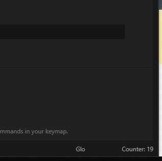
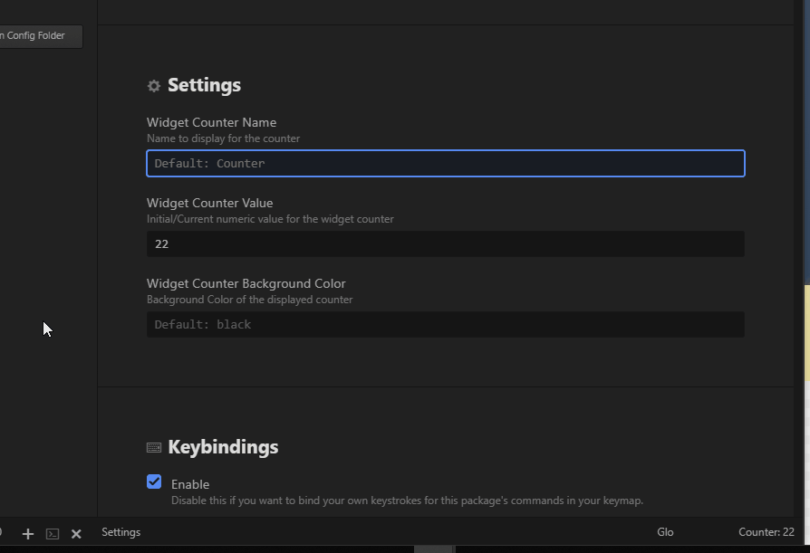
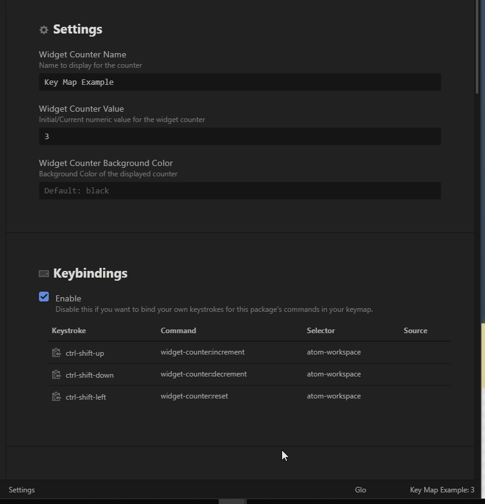
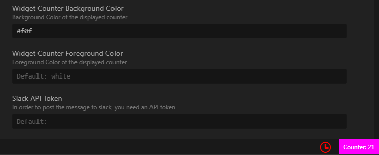

# Angelic Warefare Devotional - Package for Atom.io

  

  

## Usage

Click the counter on the status bar to add 1 and count a **WIDGET** you want to count, including your coding hours, your drinking times, times interupted, times your coworker coughed in your face, etc.  
Reset the counter to 0 in the settigs.  Additionally, you can use the hotkeys to reset things, or use them to quickly increment and decrement the count.  
Use the settings to also change the name of the counter displayed in the statusbar.  

Click the counter area in the lower right on the status bar.  

You can edit the name of the counter to be more appropriate, or more discrete as well.   

Using the hotkeys to quickly increment, decrement and reset everything.  

Change color of widget counter, both the foreground and background.  Accepts standard color words, and html hex values.  

## Feature List 

1. Click the counter on the bottom status bar to increment the count
2. Use the settings to change the display name of the counter
3. Use the settings to reset or change the value of the counter   
4. Use the Hotkey `ctrl-shift-up/uparrow` to increment  
5. Use the hotkey `ctrl-shift-down/downarrow` to decrement 
6. Use the hotkey `ctrl-shift-left/leftarrow` to reset to zero
7. Ability to customize and change the foreground and background of the counter area
8. Connect to Slack (optional), add token and message and the slack channel to the settings, and it will post new counts there  

## To Do

- Support for multiple widgets ???
- ???

Any other feature requests, please go to the GitHub Issues page and submit a feature request, or join the community and support the project by contributing.

## Issues  

The application is hosted on GitHub.  Please go to the GitHub Issues page, search for your issue.  If you see the same issue listed, please comment and add to the thread.  Otherwise, feel free to add another issue.  

**NOTE:**  
Hotkeys / keymap / keybindings I found were a bit tricky.  I wanted to use `ctrl-alt-up`,`ctrl-alt-down`,`ctrl-alt-left` or `ctrl-alt-+`,`ctrl-alt--`,`ctrl-alt-0`.   
In general, there seems to be some issues with `ctrl-alt-[arrow key]` ceaslessly firing if you hold down the `ctrl-alt` and alternate between `up` and `down` arrows, causing issues with the program.  There are other forums and posts and issues on other atom.io repos and such that people have had the same or similar issue.  The 'ctrl-alt-+` and ctrl-alt--` turned out to be an annoyance because of different keyboards.  
Some keyboards with a 9-pad recognize the `-` and `+` as the same when `ctrl` or `alt` or both are pressed and others do not.  Some recognize it as `insert` or `end` or something else, causing some issues and inconsistent tests.  I opted for the `ctrl-shift` instead for up/down and `ctrl-shift-alt` for the reset as `ctrl-shift-left` and `ctrl-shift-right` are more for selecting words.  This seems to work across the board.   
Please feel free to disable this or change this to suit your needs.  
  

## Contributing

Pull requests are welcome.  Please see the guidelines in the CONTRIBUTING.md document.  This community does have a code of conduct associated with contributions.  I am open to changes, updates and fixes.  Please, open an issue first to discuss what the change is, and then follow the guidelines.  

## License

MIT

## Thank you  

A special **THANK YOU** to all those that helped with snippett and the contributors of this project!

[Alynx Zhou](https://github.com/AlynxZhou) (Original creator - thank you!)

## Donations

